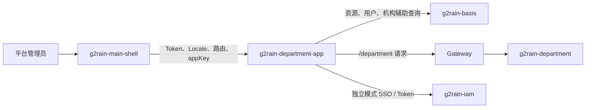

<p align="center">
  
</p>

# g2rain-department-app

[](LICENSE)
[](https://vuejs.org/)
[](https://www.typescriptlang.org/)
[](https://vite.dev/)
[](https://qiankun.umijs.org/)

> 下一代AI软件开发范式，AI原生Agent平台，开源的企业级SaaS底座。

`g2rain-department-app` 是 G2rain 的部门与数据权限管理微前端应用，为平台管理员提供部门、部门成员关系、数据权限模型、字段、元数据、权限小组及规则配置界面。应用既可由 `g2rain-main-shell` 通过 qiankun 装载，也支持独立模式联调；业务数据和最终授权由后端服务负责。

[官网](https://www.g2rain.com) · [工程文档](docs/index.md) · [Issues](https://github.com/g2rain/g2rain/issues) · [Discussions](https://github.com/g2rain/g2rain/discussions)

## 项目状态

| 项目 | 当前状态 |
| --- | --- |
| 项目版本 | `0.1.0` |
| 架构规范 | `frontend-app 1.0.0`，固定基线 `architecture-v1.1.0` |
| 采用状态 | `planned`，尚未完成正式采用 |
| 构建验证 | `npm run build` 当前失败：`src/platform/i18n/index.ts:52` 引用了未定义的 `localeCode` |
| 自动化测试 | 未配置 test/lint 脚本，当前未发现自动化测试套件 |

当前构建问题修复前，不应将本项目标记为可发布。完整偏差和验证记录见[架构偏差](docs/architecture/deviations.md)与[测试说明](docs/development/testing.md)。

## 核心能力

| 能力 | 说明 | 页面路由 |
| --- | --- | --- |
| 部门管理 | 维护部门结构、层级路径和基础信息 | `/department` |
| 部门成员关系 | 维护部门与用户之间的归属关系 | `/department_user_relation` |
| 数据权限模型 | 维护业务数据权限模型及其字段定义 | `/data_permission_model`、`/data_permission_field` |
| 数据权限元数据 | 维护数据权限规则使用的元数据 | `/data_permission_meta` |
| 权限小组 | 管理权限小组及小组成员关系 | `/data_permission_group`、`/data_permission_group_user_relation` |
| 数据权限规则 | 配置其他数据权限规则与条件 | `/data_permission_other` |
| 平台运行时接入 | 处理资源路由、认证态、国际化、路由同步和 qiankun 生命周期 | `src/runtime`、`src/platform` |

应用从 Basis 资源接口加载可访问页面和页面元素，再将资源路径映射到本地页面组件。当前资源配置包含 8 个页面、26 个页面元素，API 资源生成尚未接入主流程。

## 运行模式与协作流程



- 集成模式：默认模式，由 `g2rain-main-shell` 装载应用并注入可信运行上下文。
- 独立模式：通过 `?mode=alone` 或 `VITE_RUN_MODE=alone` 启用，由应用自行完成 IAM SSO、Token 管理和资源加载。
- 两种模式都使用 `/department` 作为默认 Context Path，并应分别完成联调验证。

## 技术栈

| 类别 | 技术 |
| --- | --- |
| 前端框架 | Vue 3、Vue Router、Pinia、Vue I18n、Element Plus |
| 语言与构建 | TypeScript、Vite、vue-tsc |
| 微前端 | qiankun、vite-plugin-qiankun |
| HTTP 与模拟 | Axios、Mock.js、vite-plugin-mock |
| 部署 | Docker、OpenResty / Nginx |

## 环境要求

- Node.js 22 或更高版本
- npm
- 本地联调时可访问 main-shell、IAM、Gateway、Basis 和 department 服务
- 构建容器镜像时需要 Docker

## 快速开始

```bash
npm ci --legacy-peer-deps
npm run dev
```

默认公开配置为：

- 应用编码：`g2rain-department-app`
- Context Path：`/department`
- 开发端口：`3002`
- Mock：关闭

本地打开独立模式时，可在访问地址后增加 `?mode=alone`。集成模式需从 main-shell 进入。

## 常用命令

| 目标 | 命令 | 说明 |
| --- | --- | --- |
| 安装依赖 | `npm ci --legacy-peer-deps` | 按锁文件安装依赖 |
| 本地开发 | `npm run dev` | 启动 Vite 开发服务 |
| 类型检查与构建 | `npm run build` | 先运行 `vue-tsc`，再生成 `dist` |
| 预览产物 | `npm run preview` | 本地预览已构建的静态产物 |
| 页面代码生成 | `npm run build:generate -- --tables=<table>` | 按数据库定义生成页面、API、类型、Mock 和路由映射 |
| 资源配置生成 | `npm run build:config` | 根据页面与权限指令刷新资源 JSON |

## 运行示例

| 示例 | 方法 | 路径 | 用途 | 调用示例 |
| --- | --- | --- | --- | --- |
| 平台前端应用本地开发 | npm | `npm run dev` | 启动前端本地开发服务，便于联调页面、路由和平台运行时能力。 | `npm run dev` |
| 平台前端应用构建 | npm | `npm run build` | 执行类型检查和前端构建，生成可部署的静态产物。 | `npm run build` |
| 平台前端应用预览 | npm | `npm run preview` | 在本地预览构建后的前端产物。 | `npm run preview` |

## 页面代码生成

代码生成器读取 `src/shared/generator/database.sql`，必须通过 `--tables` 指定目标表：

```bash
npm run build:generate -- --tables=department
npm run build:generate -- --tables=department,data_permission_model
```

可使用 `--no-view`、`--no-api`、`--no-mock`、`--no-route` 跳过对应输出。生成过程会写入或覆盖 `src/views/<table>` 下的页面、API、类型、Mock，并可能更新 `src/views/route-map.ts`；执行前应保存现有工作，执行后必须逐文件审查。

详细参数见[代码生成文档](src/shared/generator/README.md)。

## 资源配置生成

```bash
npm run build:config
```

该命令扫描 `src/views/route-map.ts` 和页面中的权限指令，并覆盖以下已跟踪文件：

- `src/shared/config-util/config/resources.json`
- `src/shared/config-util/config/pages.json`
- `src/shared/config-util/config/page-elements.json`

当前 API parser/writer 未接入主流程，因此 API 资源数量为 0。页面或权限元素变化后，应运行命令、审查差异，再执行构建和双模式人工回归。详见[资源配置生成文档](src/shared/config-util/README.md)。

## 配置说明

| 配置项 | 用途 |
| --- | --- |
| `VITE_APPLICATION_CODE` | Basis 资源加载使用的应用编码 |
| `VITE_CONTEXT_PATH` | Vite base、Router base 和代理前缀 |
| `VITE_BACKEND_ORIGIN` | 本地 Vite 代理目标 |
| `VITE_TOKEN_END_POINT`、`VITE_AUTH_END_POINT` | Token 与认证端点 |
| `VITE_SSO_BASE_URL`、`VITE_REDIRECT_URI` | 独立模式 SSO 与回调 |
| `VITE_RUN_MODE` | `alone` 表示独立模式；URL 参数优先 |
| `VITE_MOCK_ENABLED` | Mock 开关，生产环境必须关闭 |
| `VITE_SERVER_PORT` | 本地开发服务端口 |
| `VITE_MAIN_SHELL_ORIGIN`、`VITE_MAIN_SHELL_REDIRECT_PREFIX` | 主应用跳转与集成配置 |
| `VITE_I18N_TAGS` | 远程国际化消息标签 |

配置值应通过环境注入。不要将 Token、私钥、真实凭据或生产敏感地址提交到仓库或打入前端 Bundle。完整说明见[配置文档](docs/operations/configuration.md)。

## 构建与部署

标准发布构建：

```bash
npm ci --legacy-peer-deps
npm run build
```

镜像脚本示例：

```bash
./build.sh --image g2rain/g2rain-department-app --tag <tag> --build-mode production
```

镜像使用 Node.js 22 构建，并由 OpenResty 提供静态资源和 Gateway/IAM 代理。当前 Dockerfile 直接执行 Vite 构建，会绕过 `vue-tsc`，也不会自动刷新资源配置；因此镜像构建成功不能替代 `npm run build` 和资源差异审查。容器声明端口为 `8080`，Nginx 默认监听端口为 `80`，部署平台需要显式配置映射。

发布前请验证 Context Path、SSO、Gateway/IAM 连接、资源 JSON、密钥挂载、SPA 刷新和静态缓存。详见[部署文档](docs/operations/deployment.md)。

## 项目结构

| 目录 | 职责 |
| --- | --- |
| `src/views` | 部门和数据权限业务页面、页面 API、类型及 Mock |
| `src/runtime` | 应用启动、路由、认证、资源加载和运行时编排 |
| `src/platform` | qiankun、国际化、应用上下文和平台适配 |
| `src/components` | HTTP、权限、错误处理及可复用界面组件 |
| `src/shared` | 环境读取、代码生成、资源配置生成和共享工具 |
| `nginx`、`lua` | 容器静态服务、代理和签名辅助能力 |

目标依赖方向为 `views -> runtime -> platform -> components -> shared`，组合入口为 `src/main.ts` 和 `src/App.vue`。当前实现仍有已登记的反向依赖，新增代码不应扩大这些偏差。

## 与关联仓库的关系

| 仓库 | 协作关系 |
| --- | --- |
| `g2rain-main-shell` | 提供统一入口、路由同步和 qiankun 装载 |
| `g2rain-department` | 提供部门与数据权限领域数据、规则和后端 API |
| `g2rain-basis` | 提供应用资源、用户与机构辅助查询 |
| `g2rain-iam` | 提供 SSO、Token 和客户端认证 |
| `g2rain-gateway-webflux` | 提供后端 API 统一入口、鉴权和请求转发 |

## 职责边界

本仓库负责：

- 部门、成员关系和数据权限配置的前端交互；
- 本应用的页面路由、权限呈现、资源加载和微前端生命周期；
- 本项目页面代码与资源配置生成工具。

本仓库不负责：

- 部门和数据权限数据的持久化、服务端规则及最终授权；
- IAM 的认证、Token 签发和会话规则；
- Gateway 的鉴权、路由与请求转发；
- main-shell 的全局菜单、Tab 和子应用注册治理。

前端页面元素权限只用于界面呈现，不能替代服务端授权。当前 API 权限检查直接返回 `true`，后端必须始终独立完成鉴权。

## 工程文档

- [文档入口](docs/index.md)
- [项目事实](docs/project.yaml)
- [架构总览](docs/architecture/overview.md)
- [架构偏差](docs/architecture/deviations.md)
- [本地开发](docs/development/local-development.md)
- [测试说明](docs/development/testing.md)
- [配置说明](docs/operations/configuration.md)
- [部署说明](docs/operations/deployment.md)
- [安全边界](docs/security/security-boundaries.md)

## 参与贡献

我们欢迎 Issue 反馈、文档改进、功能建议与代码提交。

1. Fork 本仓库。
2. 创建特性分支：`git checkout -b feature/your-feature-name`。
3. 完成功能、测试和相关文档。
4. 运行适用的构建与检查。
5. 推送分支并提交 Pull Request。

提交前请按[完成定义](docs/development/definition-of-done.md)核对变更。当前已知构建失败不是可忽略状态，应在发布前修复并重新验证。

## 许可证

本项目基于 [Apache License 2.0](LICENSE) 开源。

## 联系我们

- Issues：[GitHub Issues](https://github.com/g2rain/g2rain/issues)
- 讨论：[GitHub Discussions](https://github.com/g2rain/g2rain/discussions)
- 邮箱：g2rain_developer@163.com

## 致谢

感谢所有为 G2rain 提交 Issue、代码、文档、建议和使用反馈的开发者。
