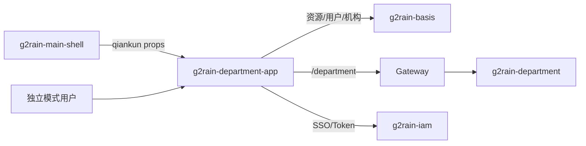

# 架构总览

本项目计划采用 g2rain [`frontend-app 1.0.0`](https://github.com/g2rain/g2rain/tree/architecture-v1.1.0/docs/architecture/profiles/frontend-app)。它是部门与数据权限领域的管理前端，不是模板项目；`package.json` 中仍指向模板仓库的元数据属于待修复偏差。

`src/main.ts` 组合 Vue、Store、i18n、权限插件、资源路由和 qiankun 生命周期。应用从 `/basis/authority/resources` 加载页面、页面元素和 API 资源，再使用 `src/views/route-map.ts` 解析八个本地页面组件。

前端负责管理交互和权限呈现；部门层级、成员关系、数据权限规则及最终授权的权威实现位于后端。

